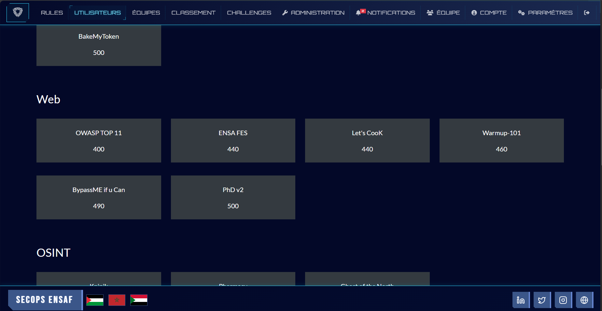
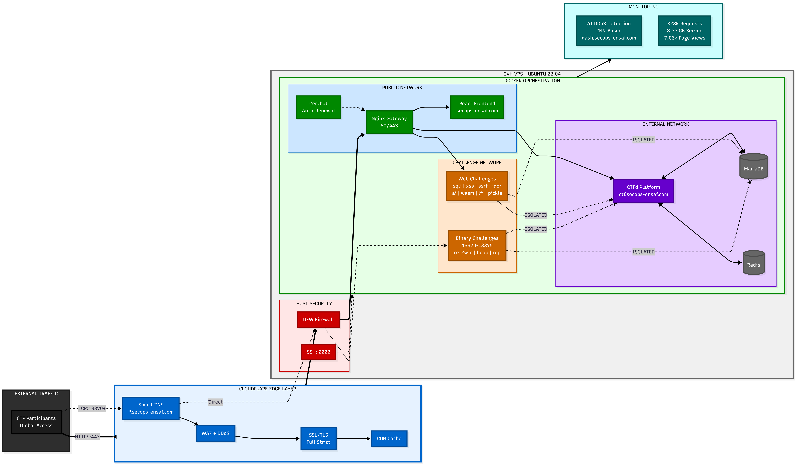

## The Problem

Hosting a Capture The Flag (CTF) competition presents a unique paradox: you are actively inviting hundreds of skilled participants to hack your infrastructure.

For CyberTech Day V3.0, we needed to support over 300 concurrent users, specifically targeting engineering students at ENSA Fès in Morocco. The platform had to host a secure main scoring application alongside a complex, multi-service environment for the competition.

The core infrastructure challenges were:

- **Resource Exhaustion:** Preventing a single intensive attack (or automated brute-force) on a specific container from taking down the entire server.
- **Containment:** Ensuring strict network isolation so that compromised containers could not pivot and access the main CTF database or other backend infrastructure components.
- **High Availability:** Maintaining 100% uptime and low latency despite heavy traffic and active DDoS attempts.

## The Solution

To address these constraints, I designed and implemented a highly decoupled, self-healing microservices architecture using **Docker Swarm** as the orchestration backbone.

The architecture was purpose-built around isolation, redundancy, and edge security. Here is how the system was structured:

### 1. Network Segmentation & Orchestration

Instead of a flat network or a monolithic setup, the infrastructure was divided into strictly isolated Docker networks to separate the frontend, backend, and vulnerable services:

- **Public-Net:** Handled ingress traffic. Only the Nginx Reverse Proxy lived here, terminating SSL and routing requests based on subdomains.
- **Internal-Net:** Housed the core backend platform (CTFd), caching (Redis), and data persistence (MariaDB). This network was completely cut off from any intentionally vulnerable services.
- **Challenge-Net:** An isolated sandbox for the vulnerable containers. Strict firewall rules prevented any outbound connections from this network to the `Internal-Net`, neutralizing lateral movement post-exploitation.

### 2. Traffic Management & Edge Security

We pushed security to the edge using **Cloudflare CDN and WAF**. This mitigated external DDoS attempts and cached static frontend assets, drastically reducing the load on the origin server.

At the application layer, **Nginx** acted as a Layer 7 Reverse Proxy. I implemented custom rate-limiting (`limit_req_zone`) to throttle abusive traffic spikes and automated SSL/TLS provisioning via Certbot for secure data transit.

### 3. Resource Allocation & Stability

To prevent container exhaustion during heavy fuzzing or exploitation attempts, strict resource quotas were enforced. Hard `mem_limit` and `cpus` constraints were applied to every isolated container. If a container panicked or consumed too much memory, Docker Swarm’s automated health checks ensured it was instantly killed and spun back up, resulting in self-healing services.

### 4. Principal Workshop Lead

Beyond architecting the system, I also served as the principal workshop lead for the event. I actively assisted ENSA Fès students with Linux configuration, Docker deployment issues, and general troubleshooting, ensuring participants could seamlessly interact with the infrastructure we built.

---

## The Results

The architectural decisions paid off, providing a seamless and highly responsive experience for the ENSA Fès participants.

- **Uptime:** Achieved **100% uptime** with zero downtime during peak traffic spikes across the 48-hour live event.
- **Traffic Handled:** Successfully served **328,880 requests** and handled 8.77 GB of bandwidth.
- **Performance:** Maintained a **1.99s average page load** time, achieving a 93% "Good" Core Web Vitals score.

Building this production infrastructure was an exercise in strategic system design—proving that with proper container isolation, edge caching, and automated orchestration, complex and inherently risky systems can remain rock-solid under pressure.
