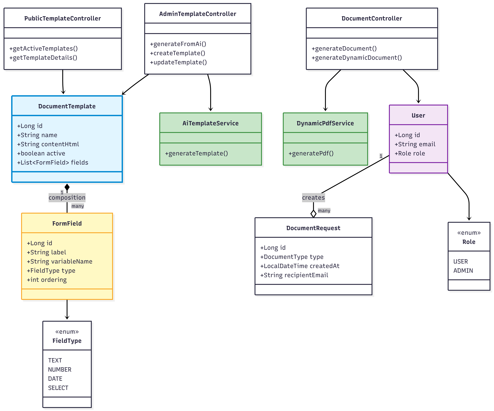
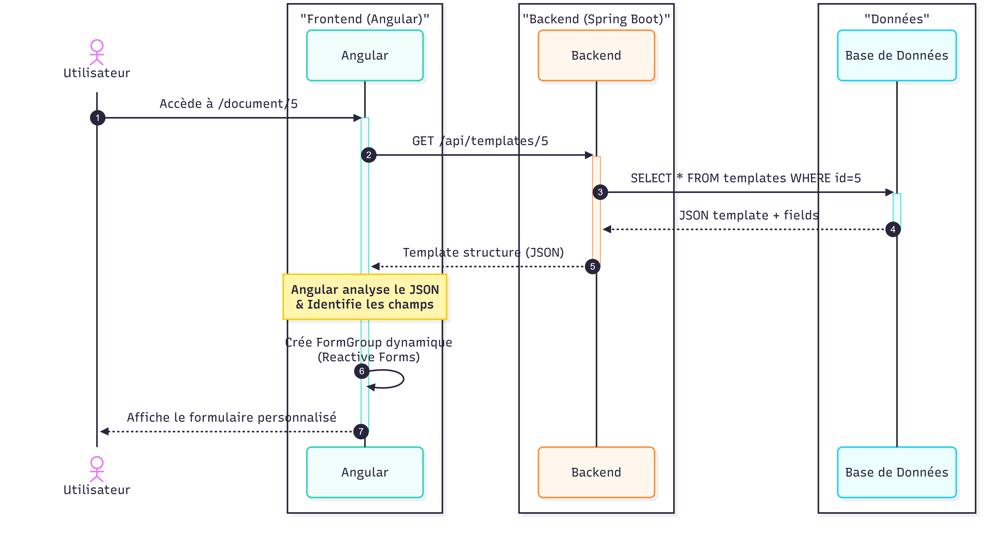

## The Problem

In many business environments, the manual creation of professional documents—such as contracts, certificates, and invoices—is highly time-consuming and prone to human error. While template-based solutions exist, they often lack the necessary flexibility to adapt to the highly specific, dynamic needs of different companies.

There was a clear need for an intelligent system that could not only generate templates on the fly but also seamlessly convert them into perfectly formatted PDFs and automatically distribute them.

## The Solution

I built **DocuGen Pro**, a comprehensive SaaS platform that automates the entire document lifecycle via a dynamic template system and Artificial Intelligence.

**Watch the Platform Demonstration:**

<video src="https://github.com/user-attachments/assets/035990b1-9b26-4237-9663-90444a6fe0ce" controls="controls" muted="muted" style="max-width: 100%;"></video>

_[Read the full Technical Report (PDF)](https://github.com/user-attachments/files/24370192/Hachem_Squalli_Elhoussaini_spring_boot_angular.pdf)_

The application was designed with a microservices-ready architecture, heavily decoupling the frontend from the backend. Here is a breakdown of the core technical implementation:

_(Note: System architecture mapping the core entities and controllers)_

### 1. AI-Powered Template Generation

To eliminate the friction of building templates from scratch, I integrated the **Groq API (running the Llama 3.3 70B model)** via asynchronous WebClient.

- Administrators simply provide a text description of the document they need.
- Through specific prompt engineering, the AI generates a strictly structured JSON file.
- This JSON defines the required form fields (Text, Number, Date, Signature) and the underlying HTML structure.

### 2. Dynamic Frontend (Angular 17)

The frontend acts as a Single Page Application (SPA) built with **Angular 17** and styled via **Tailwind CSS** and **Angular Material**.

_(Note: Sequence diagram illustrating the dynamic JSON template hydration)_

- **Challenge:** I needed to render form inputs dynamically based on an unknown, AI-generated JSON structure.
- **Fix:** I utilized Angular's `Reactive Forms` to iterate through the JSON payload, instantiating new `FormControl` objects on the fly with conditional validators (like `@Required`) depending on the field type.

### 3. Robust PDF & Email Pipeline

The backend, powered by **Spring Boot 3**, manages a sophisticated rendering pipeline:

- Data submitted by the user hydrates the template via **Thymeleaf**, replacing `{{variables}}` with real inputs.
- **Challenge:** Unclosed HTML tags would instantly break the PDF parser.
- **Fix:** I implemented **Jsoup** as an intermediary step to aggressively parse and clean the raw HTML into strictly compliant XML/XHTML.
- The sanitized output is passed to **OpenPDF / Flying Saucer** for rapid rendering (< 1 second).
- Finally, `JavaMailSender` automatically attaches the generated PDF and emails it to the recipient.

### 4. Secure Stateless Architecture

To ensure high scalability and security, the system relies on a stateless architecture.

- Authentication is handled via **JWT tokens** implemented through Spring Security Filters.
- Role-Based Access Control (RBAC) strictly separates standard `USER` endpoints from `ADMIN` template management using `@PreAuthorize` annotations.
- Data is persisted securely in a **PostgreSQL** database mapped via JPA/Hibernate.

---

## The Results

DocuGen Pro successfully transformed a tedious manual chore into an automated, one-click workflow.

By leveraging Llama 3 for structure generation and a highly optimized Thymeleaf-to-PDF pipeline, the platform achieved a **80% reduction in document creation time** for end-users. The system remains fully extensible, capable of generating everything from simple NDAs to complex, multi-page freelance contracts without requiring a single line of new code.
