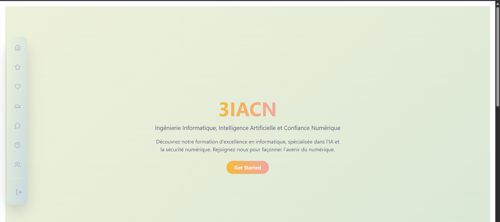

## The Problem

Many businesses, educators, and creative agencies rely heavily on Google Drive to store and share digital assets. However, sharing raw Google Drive links presents several issues:

1. **Unprofessional UX:** Dumping clients into the standard Google Drive interface lacks brand identity.
2. **Zero Visibility:** Standard Drive folders provide no granular analytics (e.g., "Did the client view the contract?", "How many times was this resource downloaded?").
3. **Permission Nightmares:** Managing access via Google accounts is tedious and prone to security risks.

While enterprise Digital Asset Management (DAM) platforms exist, they are often prohibitively expensive and overly complex for small to medium businesses.

## The Solution

I engineered a full-stack web application that serves as a secure middleman between a company's Google Drive and their clients. By utilizing **Google Service Accounts**, the platform abstracts the storage layer, presenting files through a custom, highly interactive **React** interface protected by its own JWT authentication system.

Here is a breakdown of the core technical architecture and features:

### 1. Storage Abstraction & Authentication

- **Backend Gateway:** The **Node.js/Express** backend authenticates with the Google Drive API via a secure key (`googleapis`). The end-user never interacts with actual Google Drive permissions; everything is gated behind the app's custom JWT authentication and Role-Based Access Control (RBAC).
- **Drive Manager:** Administrators can dynamically connect and manage multiple Google Drive folders via a dedicated admin dashboard, mapping them to specific client views.

### 2. Advanced Telemetry & Analytics

To provide business value beyond standard cloud storage, I built a robust, resilient tracking engine:

- **Action Tracking:** Every view, preview, and download is intercepted and logged.
- **Offline Resilience:** The tracking service (`drive.service.ts`) features an exponential backoff retry mechanism. If a network request fails, tracking data is cached in `localStorage` and automatically synced once the connection is restored.
- **File Stats:** Users can view real-time statistics for files, including total views, unique sessions, and download counts.

### 3. Dynamic UX & File Rendering

- **Intelligent File Viewer:** Engineered a custom `FileViewerModal` that dynamically renders the correct previewer based on the MIME type (using HTML5 `<video>`/`<audio>` for media, custom image fetching, and Google Docs Viewer `<iframe>` for documents).
- **Advanced Search:** Implemented custom React hooks (`useSearch`, `useFilesandFolder`) allowing users to filter assets instantly by file type, modification year, and file size parameters.
- **Session Memory:** Features like "Recently Viewed" and "Favorites" are cached locally to provide a snappy, personalized user experience upon returning to the app.

---

## The Results & SaaS Potential

This application successfully lays the architectural groundwork for a highly scalable SaaS product. By pairing the cheap, reliable storage of Google Drive with a premium, white-labeled frontend interface, it solves a major pain point for course creators, marketing agencies, and consultants.

The integration of custom analytics and resilient state management transforms a simple file repository into a powerful, data-driven client portal.
