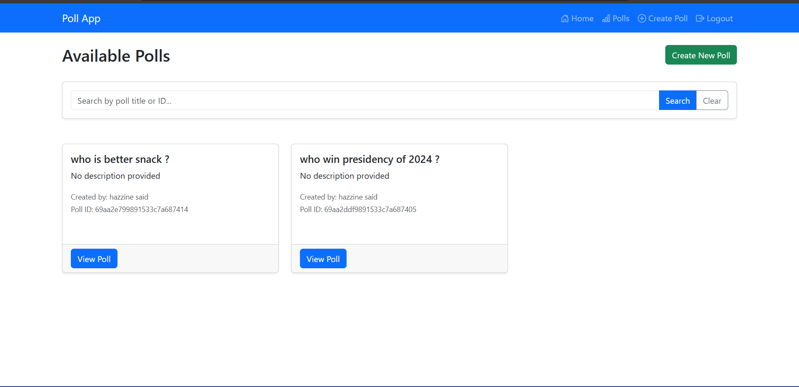
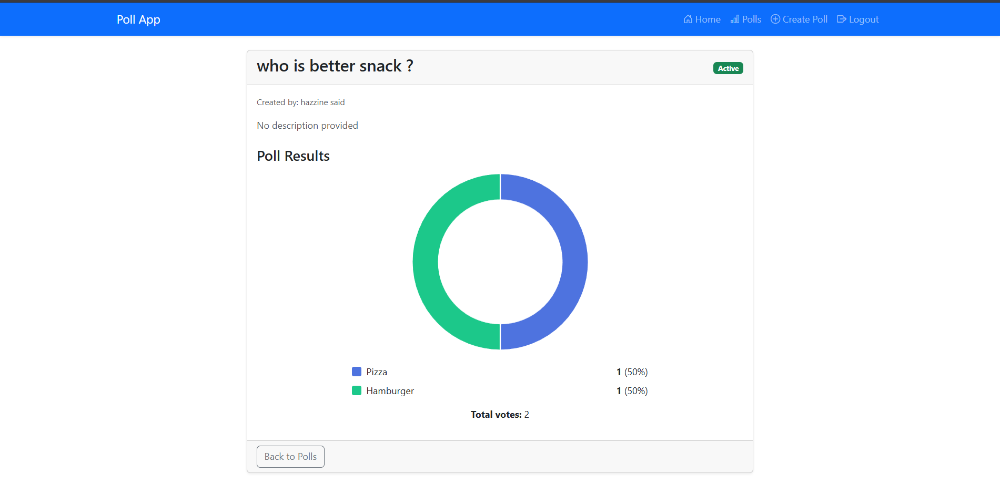

## The Problem

Building a reliable voting platform requires balancing a smooth, dynamic user experience with strict backend data integrity. We needed an application where users could seamlessly create custom polls, vote securely, and view results visually, all while ensuring that no single user could manipulate the outcome by voting multiple times.

## The Solution

I architected a robust, full-stack MVC application using **Node.js, Express, and MongoDB**, utilizing **EJS (Embedded JavaScript)** for server-side rendering and **Bootstrap 5** for a responsive frontend interface.

The core technical implementation focused heavily on security, data aggregation, and dynamic UI rendering:

### 1. Secure Authentication & Authorization

To protect the application, I implemented a custom stateless authentication flow using **JSON Web Tokens (JWT)** and **Bcrypt** for password hashing.

- **Dual-Layer Middleware:** I wrote custom middleware (`authMiddleware` for API routes and `clientAuthMiddleware` for EJS views) that extracts and verifies tokens from HTTP cookies or Bearer headers.
- **Access Control:** This ensures that only authenticated users can access the dashboard, create polls, or cast votes, completely locking down the application from unauthorized access.

### 2. Data Integrity & Migration

To prevent duplicate voting, security was enforced at the database level rather than just the application level.

- **Schema Design:** I utilized **Mongoose** to create highly relational models (`User`, `Poll`, `PollOption`, `Vote`).
- **Strict Indexing:** I applied a compound unique index (`{ poll_id: 1, user_id: 1 }`) on the `Vote` collection. This guarantees that MongoDB will explicitly reject any attempt by a user to vote twice on the same poll.
- **Database Migration:** I also authored a custom Node script (`fix.js`) to seamlessly migrate and update legacy database indexes without dropping the entire collection, demonstrating practical database administration skills.

### 3. Advanced Data Aggregation

Calculating poll results efficiently is crucial for performance. Instead of fetching all votes and counting them in memory, I leveraged **MongoDB's Aggregation Pipeline**.

- The `getPollResults` controller uses `$match`, `$group`, and `$lookup` operators to filter votes by poll, aggregate the counts per option, and join the data with the `PollOption` collection—returning a clean, fully formatted JSON response to the client in a single database query.

### 4. Dynamic Frontend & Visualization

The frontend was designed to be highly interactive despite being server-rendered.

- **Dynamic Forms:** Using Vanilla JavaScript, the poll creation interface allows users to dynamically add or remove custom poll options on the fly.
- **Data Visualization:** Once a vote is cast, the application fetches the aggregated backend data and dynamically renders a responsive, color-coded donut chart using **Chart.js**, providing immediate visual feedback to the user.

---

## The Results

The Express Poll Platform successfully delivers a secure, end-to-end voting experience. The combination of strict database-level constraints, robust JWT middleware, and an optimized MongoDB aggregation pipeline ensures that the application is both highly secure against manipulation and highly performant under load.
