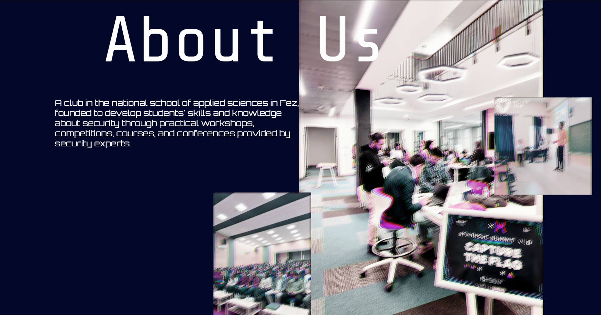
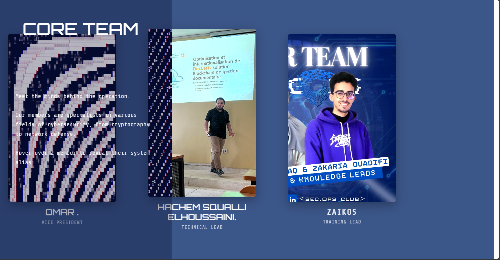
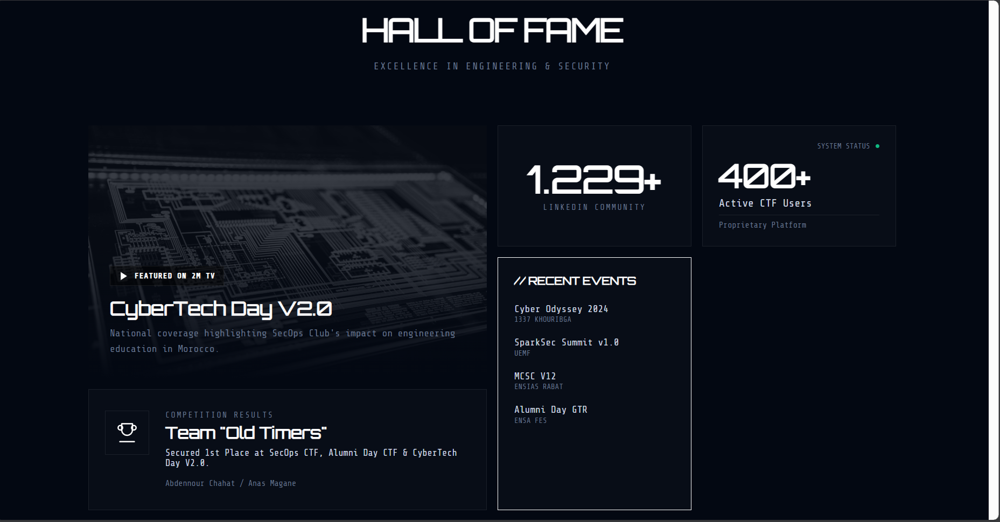

## The Problem

As the SecOps ENSAF cybersecurity club grew, we needed a digital storefront that reflected the cutting-edge nature of our organization. Standard, static web templates failed to capture the dynamic, high-tech identity of a cybersecurity team.

For our annual "CyberTech Day V3.0" event and standard club presentations, we required a modern, highly engaging landing page that could instantly capture the attention of engineering students and industry professionals. Crucially, this visual flair could not compromise performance; the page needed to maintain lightning-fast load times even under heavy traffic spikes during live CTF competitions.

## The Solution

I re-engineered the front-end interface from the ground up, combining **React** with the **GSAP (GreenSock Animation Platform)** to deliver a modern, deeply interactive User Experience (UX).

Here is a breakdown of the core frontend implementation:

### 1. High-Performance Animations (GSAP)

To create that "wow" factor without sacrificing performance, I heavily utilized GSAP. This allowed me to script complex, timeline-based animations—such as scroll-triggered reveals, staggered element loading, and dynamic text effects. By utilizing GSAP's optimized rendering, these animations ran smoothly at 60 FPS without monopolizing the browser's main thread.

### 2. Responsive & Modern UI/UX (CSS3)

- Designed a sleek, dark-mode aesthetic perfectly suited for a cybersecurity brand, using advanced **CSS3** features.
- Engineered a fully fluid layout that adapts seamlessly across all viewports—from large desktop monitors down to mobile devices—ensuring an inclusive and accessible experience for all participating students.

### 3. Edge Delivery & Integration

The frontend was containerized and deployed as a critical piece of our larger Docker Swarm architecture. I configured **Nginx** to handle the subdomain routing and integrated **Cloudflare CDN** to aggressively cache static UI assets. This ensured the landing page served as a highly available, secure gateway to our isolated backend CTF challenges.

---

## The Results

The new landing page successfully elevated the club's professional image and provided a flawless entry point for hundreds of event participants across Morocco and internationally.

- **Exceptional Optimization:** Maintained a remarkably fast **1.99s average page load** time, achieving an impressive **93% "Good" Core Web Vitals** score despite the complex visual animations.
- **Scale & Reliability:** The optimized frontend handled peak event traffic gracefully, acting as the smooth entry point for over **328,880 requests** (8.77 GB of bandwidth) during the live 48-hour CyberTech Day event with absolutely zero UI lag or downtime.

   [alt text](secops-landing_page.md)
