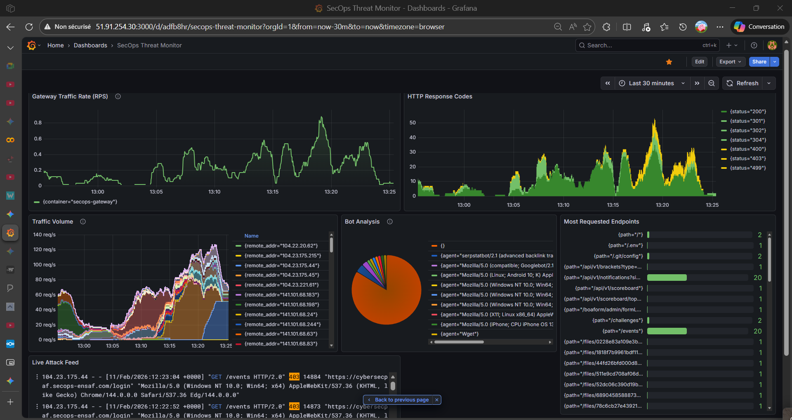

## The Problem

Following the success of [CyberTech Day V3.0](#), the [SecOps ENSAF](https://www.linkedin.com/company/secops-ensaf/) club was trusted to act as the technical partner for **Tech-Jam 2026**, the first-ever international Capture The Flag (CTF) competition hosted by the Cybersec Society at [PAF-IAST (Pak-Austria Fachhochschule)](https://paf-iast.edu.pk/) in Pakistan.

Taking our infrastructure global introduced a new magnitude of complexity. We were no longer just defending against local engineering students; we had to support over 100 highly skilled international hackers.

- **Traffic Spikes:** We anticipated a massive jump in volume, requiring the architecture to handle nearly half a million requests across 48 hours.
- **Global Latency:** Routing traffic efficiently between Morocco and Pakistan was critical to ensure a fair competition environment without frustrating lag.
- **Blind Spots:** During previous events, we lacked deep visibility into _how_ the infrastructure was being attacked. We needed a way to monitor the competition health and filter bot traffic in real-time.

## The Solution

I served as the Technical Lead, upgrading our core Docker-based foundation into a highly optimized, internationally scalable deployment with advanced telemetry.

Here is how the infrastructure evolved for the global stage:

### 1. International Performance Optimization

To combat cross-continental latency, I implemented an aggressive caching strategy using **[Cloudflare](https://www.cloudflare.com/) Edge Caching** and multi-region CDN routing (Cloudflare Argo).

- By pushing static assets and the GSAP-animated frontend to the edge, we achieved a **~60% cache hit rate**.
- This meant over 260,000 requests were served directly from local edge nodes in Pakistan and Morocco without ever touching our origin server, resulting in sub-2-second global load times.

### 2. Real-Time Observability Stack

Scaling up meant we could no longer rely on standard Docker logs. I built a comprehensive "Live Traffic Intelligence" ecosystem.

- Deployed **[Grafana](https://grafana.com/), [Loki](https://grafana.com/oss/loki/), and Promtail** to aggregate logs from Nginx, the [CTFd](https://ctfd.io/) backend, and all 15+ isolated challenge containers.
- Created custom Grafana dashboards to visualize request spikes, track HTTP 4xx/5xx error rates, and monitor container resource consumption (CPU/Memory limits). This allowed the operations team to instantly spot automated brute-force scripts and dynamically apply IP bans or rate limits.

### 3. Advanced Nginx Gateway Configuration

I refined our Layer 7 Reverse Proxy configuration to handle complex challenge routing securely.

- As seen in the architectural code (`nginx-prod.conf`), I engineered strict subdomain routing (`internal.secops`, `upload.secops`, `vault.secops`) to isolate Web and Reverse Engineering challenges.
- Enforced robust security headers (`X-Frame-Options`, `X-XSS-Protection`) and applied `limit_req_zone` (30 requests/minute) at the proxy level to prevent denial-of-service attempts on the vulnerable containers.

### 4. Challenge Engineering & Offensive Security

Transitioning from purely defensive DevOps, I also authored over 20 unique cybersecurity challenges (Web, Forensics, Reverse Engineering). Designing the very payloads and vulnerabilities used to stress-test the system proved invaluable; understanding offensive vectors directly informed how I architected the network isolation and resource quotas.

---

## The Results & International Collaboration

The collaboration between Morocco and Pakistan was a massive technical success, proving that our infrastructure was not just functional, but truly resilient under international pressure.

- **Massive Scale:** Successfully processed **439,000+ requests** and served 7 GB of bandwidth to international participants.
- **Flawless Execution:** Maintained **100% uptime** throughout the entire 48-hour competition.
- **Architectural Efficiency:** The 60% CDN cache hit rate drastically reduced server load, allowing the origin server to comfortably handle the complex backend processing and database transactions.

### 🤝 Morocco 🤝 Pakistan Partnership

Massive thanks to the entire Cybersec Society team from PAF-IAST for trusting SecOps ENSAF as their technical partner. Special shoutout to their leadership team—Jarar Abdullah (President), Raja Siraj (General Secretary), Abdullah Zaigham, and Seerat E Marryum—for the seamless coordination and collaboration.

And a huge thank you to Mariam Daoudi, President of SecOps ENSAF, for empowering me to represent our club internationally.

Building the Tech-Jam 2026 infrastructure was a masterclass in DevSecOps—bridging offensive challenge creation with the defensive architectural resilience required to host them globally.
